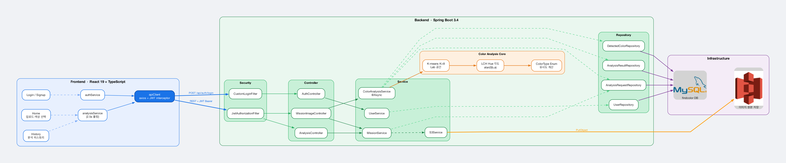

# findColor

이미지를 업로드하면 원하는 색상이 얼마나 포함되어 있는지 분석해주는 서비스입니다.  
Lab/LCH 색공간 기반 K-means 클러스터링으로 인간 시각에 가까운 색상 판별을 수행합니다.

---

## Architecture



| 구성 요소 | 기술 |
|-----------|------|
| Frontend | React 19, TypeScript, Vite, Tailwind CSS v4 |
| Backend | Spring Boot 3.4, Java 17, Spring Security + JWT |
| Image Processing | JavaCV / OpenCV — Lab K-means + LCH Hue 분석 |
| Database | MySQL 8 |
| Storage | AWS S3 |

---

## Repository Structure

```
findColor/          ← Spring Boot 백엔드
findColorFE/        ← React 프론트엔드
```

각 디렉터리에 별도 README가 있습니다.

- [Backend README](findColor/README.md)
- [Frontend README](findColorFE/README.md)

---

## Docs

| 문서 | 설명 |
|------|------|
| [색상 분석 로직](findColor/docs/color_analysis.md) | Lab K-means + LCH Hue 분석 알고리즘 |
| [알고리즘 변천사](findColor/docs/color_analysis_evolution.md) | HSV → Lab ΔE → LCH → Lab K-means 개선 기록 |
| [아키텍처 다이어그램](findColor/docs/architecture.md) | 시스템 구조 (Mermaid 시퀀스 다이어그램 포함) |
| [인증 설계](findColor/docs/auth.md) | JWT 인증·인가 흐름 |

---

## Getting Started

### Backend

```bash
cd findColor
./mvnw spring-boot:run
```

### Frontend

```bash
cd findColorFE
npm install
npm run dev
```

> 환경변수 설정은 각 README를 참고하세요.
