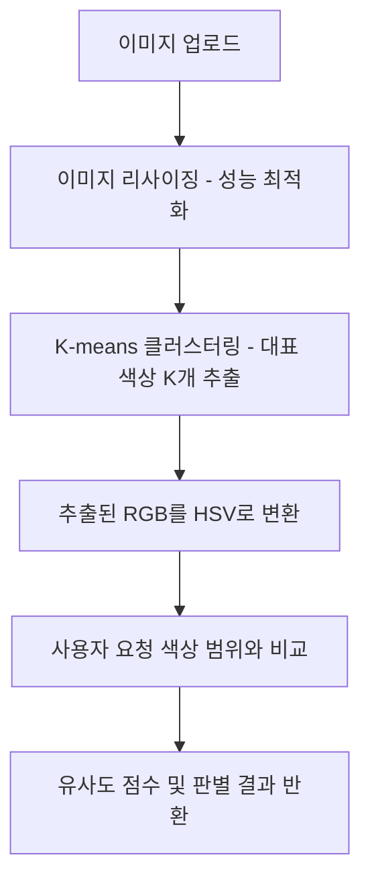

# Image Color Sentiment Analysis Logic Design

이 문서는 OpenCV, K-means 클러스터링, 그리고 HSV 색 공간을 활용하여 이미지 내의 특정 색상 감성을 추출하고 판별하는 로직을 설명합니다.

---

## 1. 기술 스택 및 선정 이유

### **1-1. OpenCV (Open Source Computer Vision Library)**
*   **이유**: 이미지 프로세싱 분야의 표준 라이브러리입니다. 이미지를 행렬(Matrix) 데이터로 변환하고 색 공간을 변경하는 데 가장 강력한 성능을 보여줍니다.

### **1-2. K-means Clustering**
*   **이유**: 이미지에는 수백만 개의 픽셀이 있습니다. 이를 일일이 분석하는 것은 비효율적입니다. K-means 알고리즘을 사용하면 이미지에서 **가장 지배적인 K개의 색상(대표 색상)**만 뽑아낼 수 있습니다. (보통 K=5~8 사용)

### **1-3. HSV Color Space (Hue, Saturation, Value)**
*   **이유**: 컴퓨터는 색을 RGB(Red, Green, Blue)로 인식하지만, 인간은 **색상(Hue), 채도(Saturation), 명도(Value)**로 인식합니다. 
    *   예를 들어 "초록색"을 찾을 때 RGB는 세 숫자를 다 계산해야 하지만, HSV는 **Hue(색상) 값의 범위**만 확인하면 되므로 훨씬 정확합니다.

---

## 2. 분석 프로세스 (Workflow)

### **Step 1: 이미지 전처리**
*   고해상도 이미지는 연산량이 너무 많습니다. 분석을 위해 적당한 크기(예: 200x200)로 축소합니다.

### **Step 2: 대표 색상 추출 (K-means)**
*   이미지의 모든 픽셀을 3차원 공간(R, G, B)에 뿌린 뒤, 서로 가까운 것들끼리 묶어 대표 포인트 K개를 찾습니다.
*   결과물: `[{Color: #00FF00, Ratio: 30%}, {Color: #0000FF, Ratio: 15%}, ...]`

### **Step 3: HSV 변환 및 매핑**
*   추출된 색상들이 사용자가 입력한 "초록" 범위에 있는지 체크합니다.
*   **초록색(Green) 범위 예시 (OpenCV 기준):**
    *   Hue: 35 ~ 85
    *   Saturation: 50 ~ 255
    *   Value: 50 ~ 255

---

## 3. 색상별 HSV 범위 정의 (기초 데이터)

| 색상 느낌 | Hue 범위 (OpenCV 기준) | 설명 |
| :--- | :--- | :--- |
| **Red** | 0~10, 170~180 | 빨강은 시작과 끝에 걸쳐 있음 |
| **Orange** | 11~25 | 따뜻한 느낌 |
| **Yellow** | 26~34 | 밝은 느낌 |
| **Green** | 35~85 | 자연, 편안한 느낌 |
| **Blue** | 86~125 | 시원한, 신뢰감 |
| **Purple** | 126~169 | 신비로운 느낌 |

---

## 4. 최종 판별 로직 (Scoring)

1.  사용자가 "Green"을 요청함.
2.  이미지에서 K-means로 5개의 대표 색상을 뽑음.
3.  5개 중 2개의 색상이 HSV 초록 범위에 해당함.
4.  그 2개 색상의 점유율(Ratio) 합계가 20%를 넘으면 **"이 이미지는 초록색 느낌이 있음"**으로 판별.

---

## 5. 주니어를 위한 구현 팁

1.  **OpenCV 의존성**: `pom.xml`에 Java용 OpenCV 또는 전처리 라이브러리(JavaCV 등)를 추가해야 합니다.
2.  **비동기 처리**: 이미지 분석은 CPU를 많이 쓰므로, 요청이 많아지면 서버가 느려질 수 있습니다. 나중에 `@Async`를 통해 비동기로 처리하는 것을 고려해 보세요.
3.  **정확도**: 조명이나 그림자에 따라 같은 초록색도 다르게 보일 수 있습니다. HSV의 Saturation(채도)와 Value(명도) 범위를 넉넉하게 잡는 것이 비결입니다.
