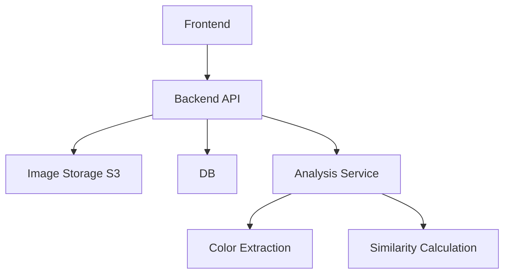
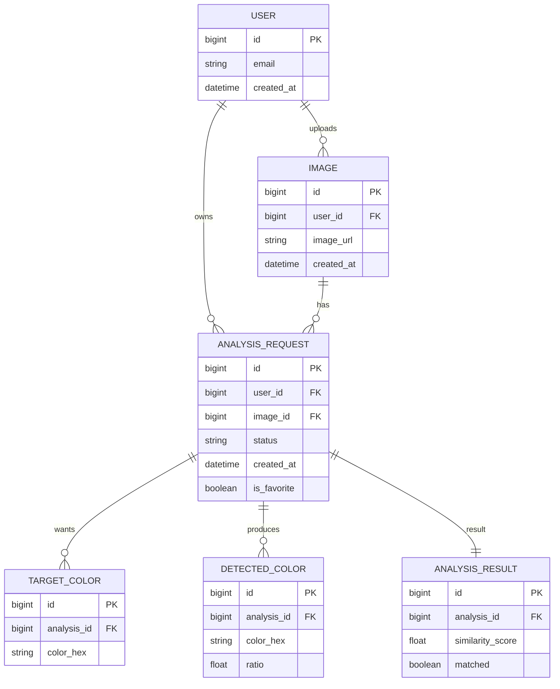
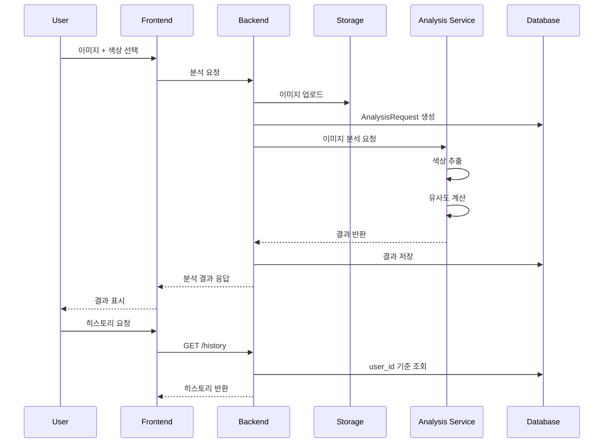
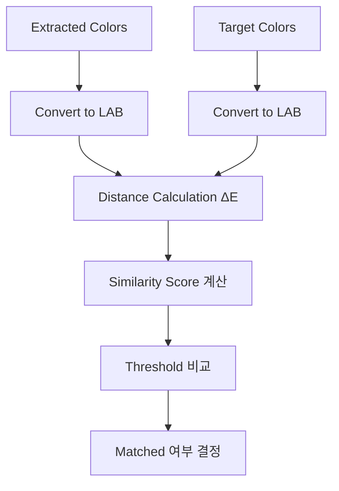

# Image Color Analysis System Design (with User History)

## 1. Architecture



------

## 2. ERD (User History Included)



------

## 3. Sequence Diagram (Analysis + History)



------

## 4. Color Similarity Flow



------

## 5. State Diagram

```

```

------

## 6. API Design

### 분석 요청

POST /api/images/analyze

### 히스토리 조회

GET /api/analysis/history?page=0&size=20

### 상세 조회

GET /api/analysis/{id}

------

## 7. Key Design Points

- AnalysisRequest 중심 설계
- user_id 기반 히스토리 조회 최적화
- 이미지 외부 저장 (S3)
- 색상 비교는 LAB 기반 ΔE 사용
- 비동기 처리 확장 가능
- 즐겨찾기(is_favorite) 지원

------

## 8. Summary

이미지 색상 분석 결과를 저장하고,
 유저별로 히스토리를 조회할 수 있는 확장 가능한 구조.
