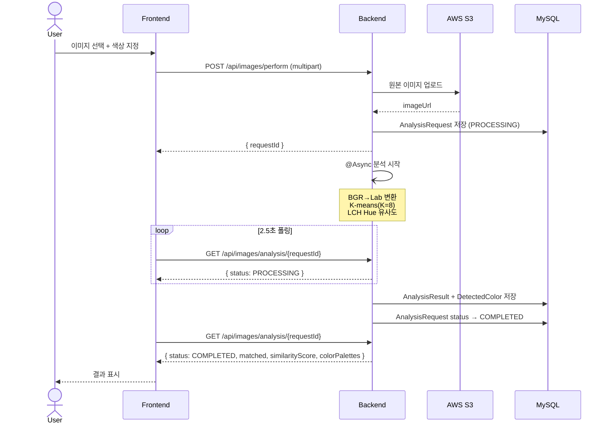
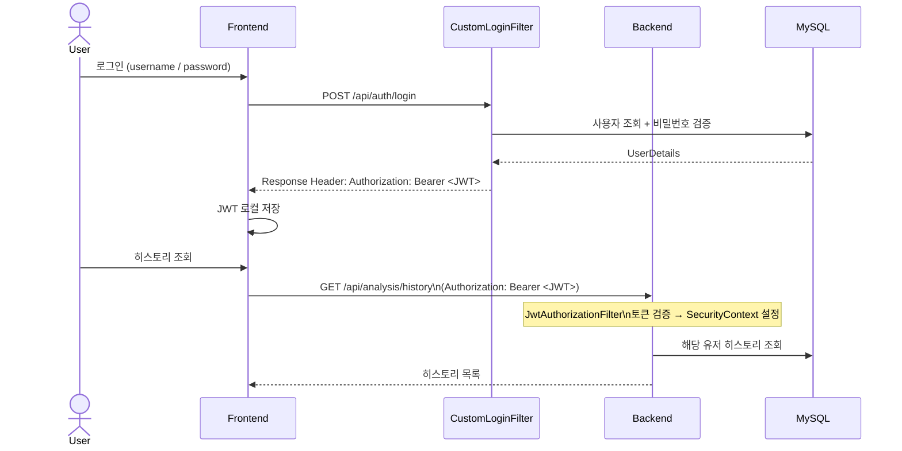

# System Architecture

## 전체 구조

```mermaid
graph TB
    subgraph FE["🖥️ Frontend (React 19 + Vite)"]
        direction TB
        P1[Login / Signup]
        P2[Home\n이미지 업로드 + 색상 선택]
        P3[History\n분석 히스토리]
        SVC1[authService]
        SVC2[analysisService]
        CLI[apiClient\naxios + JWT interceptor]
        P1 --> SVC1
        P2 --> SVC2
        P3 --> SVC2
        SVC1 --> CLI
        SVC2 --> CLI
    end

    subgraph BE["☕ Backend (Spring Boot 3.4)"]
        direction TB
        subgraph SEC["Security Layer"]
            F1[CustomLoginFilter\nPOST /api/auth/login]
            F2[JwtAuthorizationFilter\n모든 요청]
        end

        subgraph CTL["Controller Layer"]
            C1[AuthController\n/api/auth/signup]
            C2[MissionImageController\n/api/images/**]
            C3[AnalysisController\n/api/analysis/history]
        end

        subgraph SVC["Service Layer"]
            S1[UserService]
            S2[MissionService]
            S3[ColorAnalysisService\n@Async]
            S4[S3Service]
        end

        subgraph CORE["Color Analysis Core"]
            CA[K-means K=8\nLab 공간]
            CB[LCH Hue 각도\natan2 b,a]
            CC[ColorType Enum\n유사도 계산]
            CA --> CB --> CC
        end

        subgraph REPO["Repository Layer"]
            R1[UserRepository]
            R2[AnalysisRequestRepository]
            R3[AnalysisResultRepository]
            R4[DetectedColorRepository]
        end

        F1 & F2 --> CTL
        C1 --> S1
        C2 --> S2
        C2 --> S3
        C3 --> S2
        S2 --> S4
        S3 --> CORE
        S1 --> R1
        S2 --> R2
        S3 --> R3 & R4
    end

    subgraph INFRA["☁️ Infrastructure"]
        DB[(MySQL 8\nfindcolor DB)]
        S3[(AWS S3\n이미지 원본 저장)]
    end

    CLI -- "HTTP REST\nJWT Bearer" --> BE
    CLI -- "POST /api/images/perform\n→ requestId 반환" --> C2
    CLI -- "GET /api/images/analysis/{id}\n2.5초 폴링" --> C2
    S4 -- "PutObject" --> S3
    REPO -- "JPA / Hibernate" --> DB
```

---

## 이미지 분석 시퀀스



---

## 인증 흐름


