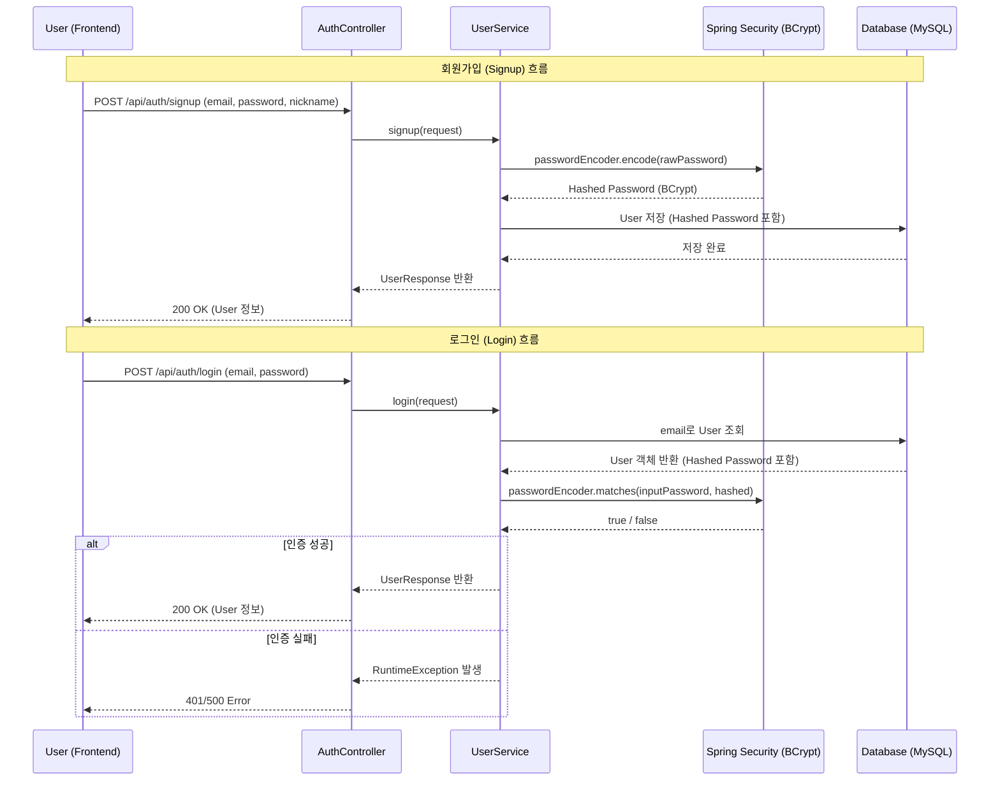

# Authentication Flow Design (Step 1: Simple Auth)

이 문서는 `findColor` 프로젝트의 초기 단계인 User/Password 기반 간편 인증과 Spring Security의 연동 흐름을 설명합니다.

## 1. 개요 (Overview)

현재 시스템은 복잡한 세션 관리나 토큰 발급 없이, 사용자의 비밀번호를 안전하게 관리하고 인증하는 데 집중합니다. Spring Security는 이 과정에서 **비밀번호 암호화(Hashing)**와 **기본 보안 설정**을 담당합니다.

## 2. 시퀀스 다이어그램 (Sequence Diagram)

## 3. 주요 구성 요소 설명

### 3-1. Spring Security 설정 (`SecurityConfig`)
*   **PasswordEncoder**: `BCryptPasswordEncoder`를 빈으로 등록하여 서비스 계층에서 주입받아 사용할 수 있게 합니다. BCrypt는 같은 비밀번호라도 매번 다른 솔트(Salt)를 사용하여 해싱하므로 보안성이 높습니다.
*   **CSRF (Cross-Site Request Forgery)**: API 서버로서의 동작을 위해 `disable()` 처리되었습니다.
*   **Authorization**: 현재는 초기 개발 단계이므로 `anyRequest().permitAll()`을 통해 모든 접근을 허용하지만, 추후 JWT 도입 시 권한별 접근 제어가 이곳에서 설정됩니다.

### 3-2. 서비스 계층 (`UserService`)
*   **회원가입**: `passwordEncoder.encode()`를 호출하여 암호화된 비밀번호만 DB에 도달하도록 보장합니다.
*   **로그인**: DB에서 조회된 해시값과 사용자가 입력한 평문을 `passwordEncoder.matches()`로 비교합니다. 평문 비밀번호는 메모리 내에서만 잠시 머물고 즉시 사라집니다.

## 4. 데이터 저장 방식 (Storage Strategy)

DB의 `users` 테이블에는 다음과 같이 데이터가 저장됩니다:
*   `email`: unique (중복 가입 방지)
*   `password`: BCrypt로 인코딩된 문자열 (예: `$2a$10$xyz...`)
*   `nickname`: 사용자 표시 이름

## 5. 단계별 진화 계획 (Evolution Path)

1.  **Step 1 (현재)**: 사용자 정보를 LocalStorage에 저장하여 로그인 상태 유지. 서버는 단순 비밀번호 일치 여부만 확인.
2.  **Step 2 (예정)**: 로그인 성공 시 JWT(JSON Web Token) 발급. 서버는 요청마다 토큰의 서명을 검증하여 인증 처리. Spring Security에 `JwtFilter` 추가.
