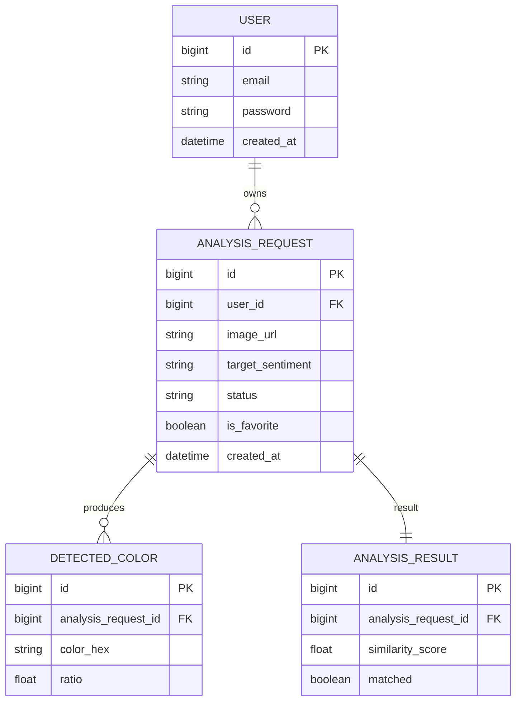

# Color Analysis

이미지에서 지배적인 색상을 추출하고, 사용자가 선택한 타겟 색상과의 유사도를 계산하는 전체 로직을 설명합니다.

---

## 1. 색공간 선택: Lab + LCH

### 왜 RGB·HSV가 아닌가

```
동일한 "노란 나뭇잎"이라도 빛/그림자에 따라:
  양지     →  RGB (200, 180, 60)
  그늘     →  RGB (90,  80,  25)
  짙은그늘 →  RGB (50,  45,  15)
```

RGB 거리는 인간 시각과 비선형입니다. K-means가 BGR 공간에서 클러스터링하면 "사람 눈에 같아 보이는 색"이 아니라 "RGB 값이 가까운 색"끼리 묶입니다.

HSV를 쓸 경우, 명도(V)가 낮으면 같은 노란색이어도 무채색 필터에 걸려 분석에서 탈락합니다. 라운드 오브젝트(꽃, 과일)처럼 하이라이트-그림자가 공존하는 이미지에서 실제 색상 면적이 과소평가됩니다.

### Lab 색공간

```
L  — 명도 (0 = 검정, 100 = 흰색)
a  — 초록 ↔ 빨강 축
b  — 파랑 ↔ 노랑 축
```

Lab은 인간 시각에 선형적으로 대응하도록 설계된 색공간입니다. 두 색의 Lab 거리가 같으면 사람 눈에도 비슷한 차이로 인식됩니다. K-means를 Lab 공간에서 수행하면 **클러스터링 기준 자체가 인간 시각 거리**가 됩니다.

### LCH — L을 버리고 Hue만 쓰는 이유

Lab에서 ΔE를 구하면 L(명도) 차이도 거리에 포함됩니다.

```
같은 노란색 (hue ≈ 85°):
  밝은 노랑   L=80, a=5,  b=45  →  ΔE to ref ≈ 5   (통과)
  어두운 황갈 L=41, a=10, b=35  →  ΔE to ref ≈ 41  (탈락)
```

a, b 채널만으로 **Hue 각도(atan2(b, a))**를 계산하고 L은 무시합니다. 어두운 그림자 속 노란색이라도 Hue는 같으므로 같은 색으로 인식합니다.

---

## 2. 분석 흐름

```
클라이언트 이미지 업로드
    │
    ├─ S3 원본 저장
    ├─ AnalysisRequest 생성 (status: PROCESSING)
    └─ @Async 분석 시작
            │
            ├─ 1. 이미지 로드   →  byte[] → Mat (imdecode)
            ├─ 2. 리사이징      →  150×150px
            ├─ 3. BGR → Lab     →  cvtColor (K-means 전에 변환)
            ├─ 4. flatten       →  N×3 (L, a, b)
            ├─ 5. K-means       →  K=8, Lab 공간에서 클러스터링
            ├─ 6. 각 클러스터:
            │       ├─ Chroma 필터 (sqrt(a²+b²) < 15 제외)
            │       ├─ Hue 계산 + 유사도
            │       ├─ brightnessWeight (Lab L 기준)
            │       └─ Lab → BGR 역변환 (hex 저장용)
            └─ 7. 결과 저장     →  status: COMPLETED / FAILED

클라이언트 폴링 (2.5초 간격)
    └─ GET /api/images/analysis/{requestId}
            └─ status가 COMPLETED 또는 FAILED이면 종료
```

### K-means를 Lab 공간에서 수행하는 이유

BGR 공간 K-means는 RGB 거리를 최소화합니다. 같은 "노란색"이라도 밝기 차이가 크면 다른 클러스터로 분리될 수 있습니다. Lab 공간에서는 인간 시각 거리를 최소화하므로, 사람 눈에 같아 보이는 색이 같은 클러스터로 묶입니다.

클러스터 중심은 Lab 값으로 나오므로 Hue 계산에 바로 사용합니다. hex 저장이 필요할 때만 Lab → BGR 역변환합니다.

---

## 3. 색상 범위 정의 (ColorType Enum)

각 색상은 Lab a, b 채널로 계산한 **Hue 각도**를 기준으로 정의됩니다.

| 색상 | 기준 Hue (°) | 허용 편차 (°) |
|------|-------------|-------------|
| RED | 40 | ±30 |
| PINK | 5 | ±25 |
| YELLOW | 85 | ±30 |
| GREEN | 130 | ±40 |
| BLUE | 285 | ±35 |
| PURPLE | 335 | ±30 |

**Hue 거리**: 색상 휠은 원형이므로 최단 경로를 사용합니다.

```java
double diff = Math.abs(hue - refHue);
double hueDist = Math.min(diff, 360.0 - diff);
```

**무채색 필터**: Chroma = sqrt(a² + b²) < 15이면 제외합니다. 무채색에서는 atan2가 잡음에 민감해 Hue가 불안정합니다.

---

## 4. 유사도 점수 계산

```
유사도 = 100 - (hueDist / maxHueDist) × 40
       → 기준 Hue 정중앙: 100점
       → 경계(maxHueDist):  60점
       → 범위 밖:            0점
```

### 밝기 가중치 (brightnessWeight)

극단적으로 어두운 클러스터는 색상 판별이 불안정하므로 가중치를 낮춥니다.  
HSV 변환 없이 Lab L을 직접 사용합니다.

| Lab L | 가중치 |
|-------|--------|
| L < 12 | 0.0 |
| 12 ≤ L < 20 | 선형 0.5 ~ 1.0 |
| L ≥ 20 | 1.0 |

### matched 판정 기준 (두 조건 모두 충족)

**조건 1 — WeightedScore 임계값**

```
targetWeightedScoreSum = Σ (유사도 × 클러스터비율 × brightnessWeight)
→ matchScoreThreshold(15.0) 이상
```

**조건 2 — Dominant 체크**

```
otherChromaticRatio = totalChromaticRatio - targetColorTotalRatio
→ targetColorTotalRatio × 2 > otherChromaticRatio
  (타겟 색이 유채색 픽셀의 33% 초과)
```

유채색 기준: Chroma ≥ 15 AND L ≥ 12. 흰 배경·회색 배경을 제외한 실제 색상끼리 비교합니다.

```java
double chroma = Math.sqrt(labA * labA + labB * labB);
if (chroma >= 15.0 && labL >= 12.0) {
    analysisData.totalChromaticRatio += ratio;
}

boolean isMatched = targetWeightedScoreSum >= matchScoreThreshold
        && targetColorTotalRatio * 2 > otherChromatic;
```

`similarityScore`는 8개 클러스터 중 가장 높은 단일 유사도 점수입니다 (0~100).

---

## 5. ERD



---

## 6. API

| Method | URL | 설명 |
|--------|-----|------|
| POST | `/api/images/perform` | 이미지 업로드 + 분석 요청 (requestId 반환) |
| GET | `/api/images/analysis/{requestId}?targetSentiment=Green` | 분석 상태 폴링 |
| GET | `/api/analysis/history` | 유저별 히스토리 (JWT 필요) |

**응답 예시 (폴링 완료)**
```json
{
  "status": "COMPLETED",
  "matched": true,
  "similarityScore": 87.3,
  "colorPalettes": [
    { "hex": "#4CAF50", "ratio": 0.42 },
    { "hex": "#388E3C", "ratio": 0.28 }
  ]
}
```
