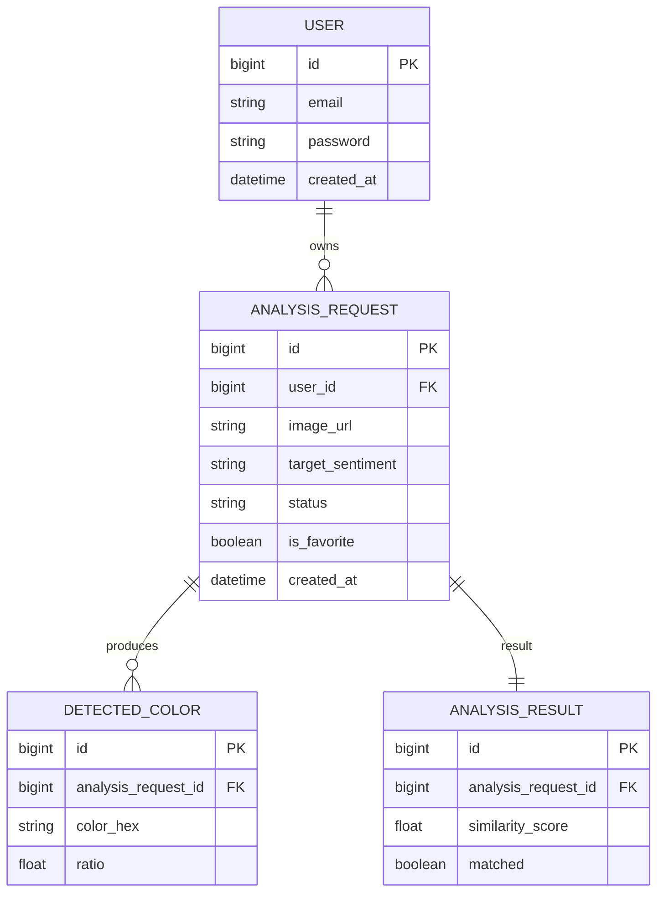

# Color Analysis

이미지에서 지배적인 색상을 추출하고, 사용자가 선택한 타겟 색상과의 유사도를 계산하는 전체 로직을 설명합니다.

---

## 1. 왜 HSV인가

OpenCV는 RGB(R, G, B)로 색상을 저장하지만, 분석에는 **HSV 색공간**을 사용합니다.

```
동일한 "초록 잔디"라도 조명에 따라:
  맑은 날  →  RGB (120, 180, 80)
  그늘     →  RGB (40,  80,  30)  ← 완전히 다른 값
```

RGB에서는 밝기 변화가 R, G, B 세 채널 전부에 영향을 미칩니다.  
HSV는 색의 본질을 세 축으로 분리합니다.

| 축 | 의미 |
|----|------|
| **H** (Hue) | 색상 자체. 조명이 바뀌어도 안정적 |
| **S** (Saturation) | 색의 선명함 |
| **V** (Value) | 밝기 |

H 값만으로 색상을 판별하므로 조명 조건이 다양한 실사 이미지에서도 신뢰할 수 있습니다.

> OpenCV는 BGR 순서로 색을 저장합니다. 코드에서 `b, g, r` 순서로 꺼내는 이유입니다.

---

## 2. 분석 흐름

```
클라이언트 이미지 업로드
    │
    ├─ S3 원본 저장
    ├─ AnalysisRequest 생성 (status: PROCESSING)
    └─ @Async 분석 시작
            │
            ├─ 1. 이미지 로드  →  byte[] → Mat (imdecode)
            ├─ 2. 리사이징     →  150×150px (K-means 연산량 감소)
            ├─ 3. K-means      →  K=8 대표 색상 추출
            ├─ 4. HSV 변환     →  BGR → HSV (cvtColor)
            ├─ 5. 유사도 계산  →  ColorType.calculateSimilarity()
            └─ 6. 결과 저장    →  status: COMPLETED / FAILED

클라이언트 폴링 (2.5초 간격)
    └─ GET /api/images/analysis/{requestId}
            └─ status가 COMPLETED 또는 FAILED이면 종료
```

### K-means를 쓰는 이유

150×150 이미지에도 22,500개의 픽셀이 있습니다. 전체 픽셀을 개별 분석하는 것은 비효율적입니다.  
K-means로 **가장 지배적인 8가지 대표 색상**만 뽑아내면 정확도는 유지하면서 연산을 크게 줄일 수 있습니다.

---

## 3. 색상 범위 정의 (ColorType Enum)

| 색상 | H 주 범위 | H 보조 범위 | 설명 |
|------|-----------|------------|------|
| **RED** | 0–15 | 160–180 | 색상 휠의 양 끝단을 모두 포함 |
| **PINK** | 140–179 | — | 마젠타~핫핑크~딥핑크 (장미 계열 포함) |
| **YELLOW** | 15–40 | — | 주황~연두 사이 |
| **GREEN** | 35–95 | — | 청록빛까지 포함하도록 확장 |
| **BLUE** | 90–145 | — | 하늘색~남색 |
| **PURPLE** | 120–155 | — | 블루바이올렛~보라 계열 |

**무채색 필터**: S < 50 또는 V < 50이면 색상 판별 대상에서 제외합니다.  
배경 회색, 흰색, 매우 어두운 색 등 색상 정보가 불안정한 클러스터를 제거합니다.

```java
// ColorType.isMatch()
if (s < 50 || v < 50) return false;
if (h >= minH && h <= maxH) return true;
// RED처럼 보조 범위가 있는 경우
if (altMinH != null) return h >= altMinH && h <= altMaxH;
```

---

## 4. 유사도 점수 계산

단순 "있다/없다" 이진 판별 대신, **얼마나 타겟 색상에 가까운지** 0–100 점수로 계산합니다.

```
H 위치 점수  =  100 - (|H - 범위중심| / 범위절반 × 30)
                → 범위 중심: 100점, 범위 경계: 70점

채도 가중치  =  S / 255 × 0.2 + 0.8
                → S=255(최대): 1.0배, S=25(최소): 0.82배

최종 점수    =  H 위치 점수 × 채도 가중치  (최대 100.0)
```

**최종 matched 판정 기준 (두 조건 모두 충족 필요)**

1. **절대 임계값**: 유사도 ≥ 70.0인 클러스터 면적 합 ≥ 전체 이미지의 **20%**
2. **dominant 체크**: 요청 색이 유채색(S≥50, V≥50) 픽셀의 **33% 초과**

`similarityScore`는 8개 클러스터 중 가장 높은 점수입니다.

```java
// ColorAnalysisService
if (similarity >= 70.0) {
    targetColorTotalRatio += ratio;
}
if (s >= 50 && v >= 50) {
    totalChromaticRatio += ratio;  // 유채색 합계
}

double otherChromaticRatio = totalChromaticRatio - targetColorTotalRatio;
boolean isMatched = targetColorTotalRatio >= 0.20          // 조건 1
        && targetColorTotalRatio * 2 > otherChromaticRatio; // 조건 2 (T > C/3)
```

dominant 체크를 유채색 픽셀 기준으로 하는 이유: 흰 배경·회색 배경이 있는 이미지에서 배경을 제외한 실제 색상끼리 경쟁하도록 하기 위해서입니다. 배경까지 포함하면 배경이 있는 이미지는 어떤 색도 dominant로 인정받기 어렵습니다.

---

## 5. ERD



---

## 6. API

| Method | URL | 설명 |
|--------|-----|------|
| POST | `/api/images/perform` | 이미지 업로드 + 분석 요청 (requestId 반환) |
| GET | `/api/images/analysis/{requestId}?targetSentiment=Green` | 분석 상태 폴링 |
| GET | `/api/analysis/history` | 유저별 히스토리 (JWT 필요) |

**응답 예시 (폴링 완료)**
```json
{
  "status": "COMPLETED",
  "matched": true,
  "similarityScore": 87.3,
  "colorPalettes": [
    { "hex": "#4CAF50", "ratio": 0.42 },
    { "hex": "#388E3C", "ratio": 0.28 }
  ]
}
```
